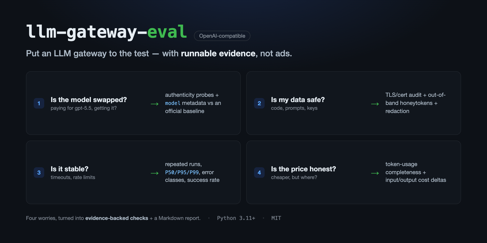
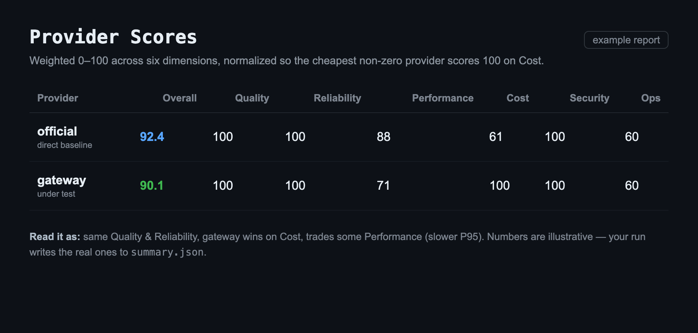
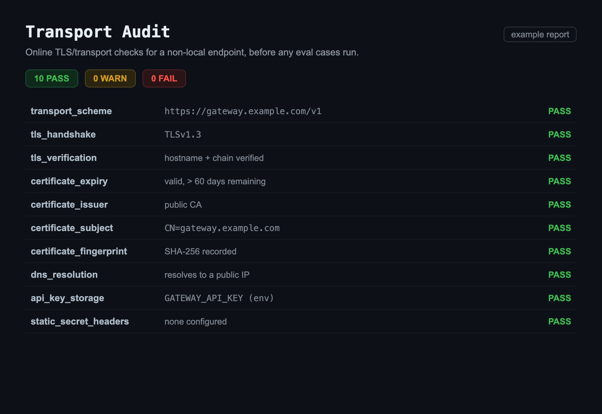

<div align="center">



<h1>llm-gateway-eval</h1>

<strong>把 OpenAI 兼容的 LLM 网关拉上测试台——用能跑的证据说话，而不是广告。</strong>

<p><em>把四个顾虑（模型真伪 / 数据安全 / 稳定性 / 价格）变成能跑、有证据的检查。</em></p>

<p>
<a href="https://www.python.org/"></a>
<a href="LICENSE"></a>
<a href="https://github.com/androidZzT/llm-gateway-eval"></a>
<a href="https://platform.openai.com/docs/api-reference/chat"></a>
</p>

<p>
<a href="#安装">安装</a> &bull;
<a href="#60-秒快速上手">快速上手</a> &bull;
<a href="#用法">用法</a> &bull;
<a href="#评测内容">评测内容</a> &bull;
<a href="#示例报告">示例报告</a> &bull;
<a href="README.md">English</a>
</p>

</div>

---

当你把真实的代码和真金白银交给一个 OpenAI 兼容网关时，有四个顾虑始终甩不掉：
**模型是不是你付费买的那个、数据安不安全、稳不稳定、价格诚不诚实？**
`llm-gateway-eval` 把每一个顾虑都变成一项能跑、有证据支撑的检查。

它会把同一份 JSONL 评测用例在你的网关上重放——可选地，再在一个官方直连基线上重放一遍——
随后采集模型真伪信号、隐私/安全探针、延迟与错误统计、以及 token/成本准确性，
最终汇总成一份你可以阅读或分享的 Markdown 报告。

| 顾虑 | 检查内容 |
| --- | --- |
| **模型被掉包了吗？** | 模型真伪探针与响应元数据核对，可选地与官方直连提供方做并排对比。 |
| **我的数据安全吗？** | 传输审计（HTTPS/TLS、证书、静态密钥请求头）、隐私/安全用例、可选的带外蜜签外泄监控，以及输出脱敏。 |
| **它稳定吗？** | 重复运行，统计 P50/P95/P99 延迟、错误分类、重试次数与请求成功率。 |
| **价格诚实吗？** | token 用量完整性，以及相对基线估算的输入/输出成本差值。 |

---

## 安装

需要 **Python 3.11+** 和 [uv](https://docs.astral.sh/uv/)。

```bash
git clone https://github.com/androidZzT/llm-gateway-eval.git
cd llm-gateway-eval
uv sync
```

---

## 60 秒快速上手

只用一个 URL、一个 API key 和一个模型名，就能把工具指向某个网关：

```bash
uv run llm-gateway-eval gateway-quick-eval \
  --gateway-url https://gateway.example.com/v1 \
  --gateway-api-key "..." \
  --model gpt-5.5
```

这一条命令会审计传输层、运行核心评测用例外加动态安全探针，并写出：

- `runs/gateway-quick-eval/quick_config.json` —— 解析后的运行配置（只含环境变量名，不含密钥）。
- `runs/gateway-quick-eval/audit.json` —— HTTPS/TLS、密钥处理与静态密钥检查。
- `runs/gateway-quick-eval/security_probes.json` —— 本次运行的 canary 与篡改探针定义。
- `runs/gateway-quick-eval/results.jsonl` —— 真伪、隐私/安全与稳定性的逐用例证据。
- `runs/gateway-quick-eval/summary.json` —— 通过率、延迟、错误分类、用量/计费、路由/降级、安全分析与评分。
- `reports/gateway-quick-eval.md` —— 给人看的报告。

> 优先使用 `--gateway-api-key-env GATEWAY_API_KEY`（或 `--gateway-api-key-env <YOUR_VAR>`），
> 而不是在命令行里直接传明文密钥，这样密钥就不会留在 shell 历史里。

---

## 用法

### 添加官方直连基线

要判断一个网关是否在掉包或降级模型，最快的办法就是在同一次运行里，
把它和官方提供方并排跑一遍：

```bash
export OPENAI_API_KEY="..."

uv run llm-gateway-eval gateway-quick-eval \
  --gateway-url https://gateway.example.com/v1 \
  --gateway-api-key "..." \
  --model gpt-5.5 \
  --official-url https://api.openai.com/v1 \
  --official-api-key-env OPENAI_API_KEY
```

### 带外泄露检测（蜜签 honeytoken）

要检测网关是否把你的数据转发到了不该去的地方，可以传入一个 webhook/canary 基础 URL。
本次运行会在某个安全探针里嵌入一个唯一的 URL 蜜签：

```bash
uv run llm-gateway-eval gateway-quick-eval \
  --gateway-url https://gateway.example.com/v1 \
  --gateway-api-key "..." \
  --model gpt-5.5 \
  --honeytoken-base-url https://webhook.example/hook
```

从你的 webhook/canary 服务导出事件后，再把它们导回这次运行，以更新 summary 并重新渲染报告：

```bash
uv run llm-gateway-eval honeytoken-events runs/gateway-quick-eval \
  --events webhook-events.jsonl \
  --report-out reports/gateway-quick-eval.md
```

> 如果一次运行同时包含官方与网关两个目标，那么 webhook 命中只能证明发生了带外暴露，
> 却无法确定是哪个目标导致的。需要归因时，请使用只含网关的运行，或把官方/网关分成两次运行。

### 完整 YAML 工作流

要做可复现、由配置驱动的评测，可用一份 YAML 配置串起 `validate` → `run` → `report`。
示例配置引用了 `LLM_GATEWAY_API_KEY` 和 `OPENAI_API_KEY` 这两个环境变量：

```bash
export LLM_GATEWAY_API_KEY="..."
export OPENAI_API_KEY="..."

uv run llm-gateway-eval validate \
  --config configs/eval.example.yaml \
  --cases data/cases/smoke.jsonl

uv run llm-gateway-eval run \
  --config configs/eval.example.yaml \
  --cases data/cases/smoke.jsonl \
  --out runs/smoke

uv run llm-gateway-eval report runs/smoke --out reports/smoke.md
```

项目还内置了一套偏安全的用例集。先审计传输层，再运行核心用例：

```bash
uv run llm-gateway-eval audit --config configs/eval.gateway-core.yaml --online-tls

uv run llm-gateway-eval run \
  --config configs/eval.gateway-core.yaml \
  --cases data/cases/gateway_core.jsonl \
  --out runs/gateway-core

uv run llm-gateway-eval report runs/gateway-core --out reports/gateway-core.md
```

### Codex 与编码 Agent 对比

除了 API 用例，你还可以对比一个真实的编码 Agent 在官方模型上、以及在同一模型经网关路由后的行为表现。

只用一个 URL 和一个 key，就能把你当前的官方 Codex 配置和某个网关做对比：

```bash
uv run llm-gateway-eval codex-quick-compare \
  --gateway-url https://gateway.example.com/v1 \
  --gateway-api-key "..." \
  --model gpt-5.5 \
  --gateway-price-multiplier 0.8
```

要做精确的成本对比，可以传入按每 100 万 token 计的网关单价，而不是一个倍率：

```bash
uv run llm-gateway-eval codex-quick-compare \
  --gateway-url https://gateway.example.com/v1 \
  --gateway-api-key "..." \
  --model gpt-5.5 \
  --gateway-input-price 4.00 \
  --gateway-cached-input-price 0.40 \
  --gateway-output-price 24.00
```

要直接对比基于订阅的编码 Agent，可以用你本地已认证的 `codex` 和 `claude` CLI
运行同一批可执行任务（无需 API key）：

```bash
uv run llm-gateway-eval agent-compare \
  --codex-model gpt-5.5 \
  --claude-model sonnet \
  --cctrace \
  --repeats 3
```

带上 `--cctrace` 后，每次运行还会在其工作区下保存一个本地 trace 会话。Claude Code
同样可以经一个 Anthropic Messages 兼容网关路由：

```bash
uv run llm-gateway-eval agent-compare \
  --no-codex \
  --claude-gateway-url https://gateway.example.com \
  --claude-gateway-api-key "..." \
  --claude-model claude-sonnet-4-6
```

要做基于具名 profile 的 Codex 对比（profile 在你的 Codex 配置里定义），
请设置你的网关 profile 所引用的那个环境变量：

```bash
GATEWAY_API_KEY=... uv run llm-gateway-eval codex-compare \
  --tasks data/codex_tasks \
  --official-profile official \
  --gateway-profile gateway \
  --repeats 3 \
  --out runs/codex-gateway \
  --report-out reports/codex-gateway.md
```

Agent 与 profile 的具体配置详见 [docs/agent-compare.md](docs/agent-compare.md)
与 [docs/codex-compare.md](docs/codex-compare.md)。

### 网站任务基准

要做更贴近真实的质量检查，可以拿一个小型静态网站当作任务，让官方 Codex
和经网关路由的 Codex 实现完全相同的提示词。每个任务目录包含：

- `TASK.md`：交给 Codex 的提示词。
- `repo/`：初始项目。
- `repo/verify.sh`：确定性的验收检查。

```bash
export GATEWAY_API_KEY="..."

uv run llm-gateway-eval codex-quick-compare \
  --gateway-url https://gateway.example.com/v1 \
  --gateway-api-key-env GATEWAY_API_KEY \
  --model gpt-5.5 \
  --wire-api responses \
  --tasks data/website_tasks_blog \
  --repeats 1 \
  --timeout-seconds 720 \
  --out runs/personal-blog-compare \
  --report-out reports/personal-blog-compare.md
```

从两个层面解读任务结果：

- **功能质量：** `verify.sh` 是否通过，生成的 UI 是否满足任务提示词？
- **Agent 稳定性与效率：** Codex 是否干净退出、耗时多久、消耗了多少输入/输出/推理 token？

这种区分很重要：一次运行可能产出了一个有效的网站，却在额外的自检阶段超时。
请把截图和原始 `results.jsonl` 作为本地证据保留在 `reports/` 和 `runs/` 下；
除非你有意公开这些证据，否则不要提交它们。

---

## 评测内容

- 模型真伪：响应模型元数据是否不匹配、是否具备直连基线对比条件，以及标记为 `model_authenticity` 的高置信能力探针。
- 传输安全：`audit` 检查 HTTPS 使用、TLS 主机名校验、证书过期，以及明显的静态密钥请求头。
- 隐私泄露：安全/隐私用例、可选的外部蜜签事件导入，以及对 API key、bearer token、JWT、邮箱与常见密钥赋值在结果/报告输出中的默认脱敏。
- 稳定性：重复用例运行、重试次数、P50/P95/P99 延迟、网络错误数、HTTP/模型调用错误数，以及请求成功率。
- 质量：按用例、按类别、按提供方的断言通过率。
- 可靠性：请求成功率、错误，以及失败的断言。
- 性能：P50/P95/P99 延迟，每秒输出 token 数。
- 成本与用量准确性：按提供方估算的输入/输出 token 成本、用量完整性、总 token 一致性，以及与官方基线配对的 token 差值。
- 路由/降级：模型元数据变体、官方与网关之间的质量差距、重复用例的输入 token 波动、通过/失败抖动，以及 temperature 为 0 时的输出漂移。
- 兼容性：JSON schema 成功率、用量字段可用性、流式字段占位情况。
- 安全/安全防护覆盖：标记或归类为 `safety`、`security`、`privacy` 的用例通过率。

---

## 示例报告

下面这些截图来自一次示例运行。你自己报告里的真实数字，由各自的 run 写进 `summary.json`，
再由 `report` 渲染出来。

<table>
  <tr>
    <td align="center"><strong>Provider scores</strong></td>
    <td align="center"><strong>Transport audit</strong></td>
  </tr>
  <tr>
    <td></td>
    <td></td>
  </tr>
</table>

---

## 用例格式

每一行 JSONL 都是一个 `EvalCase`：

```json
{"id":"json_intent","category":"compatibility","messages":[{"role":"user","content":"Only return JSON: {\"intent\":\"billing\"}"}],"assertions":[{"type":"json_schema","schema":{"type":"object","required":["intent"],"properties":{"intent":{"const":"billing"}}}}],"tags":["json"]}
```

支持的断言类型：

- `contains`
- `not_contains`
- `equals`
- `regex`
- `json_schema`
- `refusal_expected`

---

## 项目结构

```
src/llm_gateway_eval/   CLI, OpenAI-compatible client, assertions, metrics, pricing,
                        security probes, Codex/Claude agent comparison, and reporting
configs/                example YAML configs (generic + gateway-core)
data/cases/             JSONL API eval cases
data/codex_tasks/       executable coding-agent tasks
data/website_tasks_*/   static-website benchmark tasks
templates/              Markdown report templates
docs/                   methodology and setup notes
tests/                  unit and integration smoke tests
```

`runs/`、`reports/`、缓存与虚拟环境等生成产物已被 git 有意忽略。
请把这些目录当作本地证据，而非源码。

一个用于端到端工作流的 Codex skill 内置在 `llm-gateway-eval-report/` 目录里；
把它复制或软链到 `~/.codex/skills/` 即可在本地安装。

---

## 注意事项与限制

- 优先通过环境变量传入 API key（`--gateway-api-key-env`、配置项 `api_key_env`）。不要提交明文密钥，也不要在 shell 历史里传入。
- 结果与报告里保存的是脱敏后的输出；断言是在脱敏之前、针对原始提供方响应执行的。
- 本地运行产物里仍可能包含提示词、生成的代码、模型输出、端点名称、延迟、用量与定价证据。分享前请先审阅或脱敏。
- `runs/` 与 `reports/` 默认被忽略，以免敏感的本地证据被误提交。
- 模型真伪探针用于发现可疑的不匹配与回退。它们是异常检测，而非提供方正在服务某个特定模型的密码学证明。
- 第一个版本面向 OpenAI 兼容的 Chat Completions（`/chat/completions`）。
- Ragas、promptfoo 红队、k6/Locust、OpenTelemetry 与 Langfuse 被有意保留为未来的扩展点。

推荐的解读方式详见 [docs/evaluation-methodology.md](docs/evaluation-methodology.md)。

---

## 许可证

基于 [MIT License](LICENSE) 发布。
